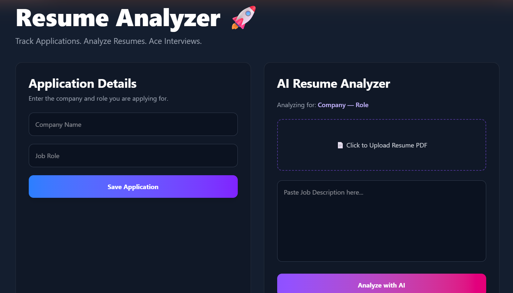
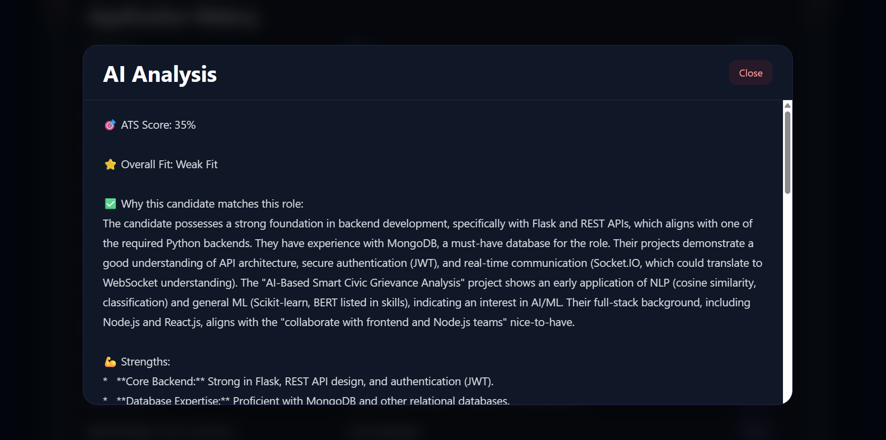
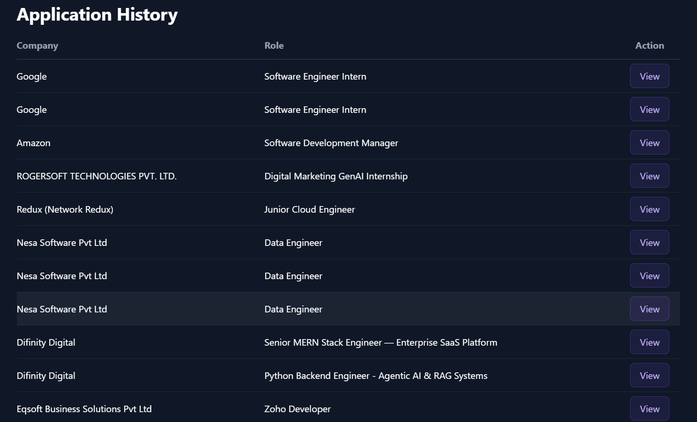

# Resume-Analyzer 🚀

An AI-powered placement tracker and resume analyzer that helps students and early-career developers optimize their resumes for specific job descriptions.

🌐 Live Demo

Frontend:

https://resume-analyzer-frontend-gfif.onrender.com

Backend API:

https://resume-analyzer-backend-ktnu.onrender.com

## ✨ Features

* 📄 Upload PDF resumes
* 🤖 AI-powered resume analysis using Google Gemini
* 🎯 ATS score estimation
* 📊 Job-role matching and overall fit analysis
* 💼 Track job applications
* 📚 View application history and previous AI analyses
* 🪟 Modern modal-based UI for viewing analysis reports

## 🛠️ Tech Stack

### Frontend

* React.js
* Vite
* Tailwind CSS
* Framer Motion
* Axios

### Backend

* Node.js
* Express.js
* MongoDB Atlas
* Mongoose
* Multer
* PDF-Parse

### AI

* Google Gemini API

## 📂 Project Structure

```
Resume-Analyzer/
│
├── backend/
│   ├── models/
│   ├── routes/
│   ├── services/
│   └── app.js
│
├── frontend/
│   ├── src/
│   │   ├── components/
│   │   └── App.jsx
│   └── package.json
│
└── README.md
```

## ⚙️ Installation

### Clone the repository

```bash
git clone https://github.com/VimalVarghese2001/Resume-Analyzer.git
cd Resume-Analyzer
```

### Backend Setup

```bash
cd backend
npm install
npm start
```

### Frontend Setup

```bash
cd frontend
npm install
npm run dev
```

## 🔑 Environment Variables

Create a `.env` file inside the `backend` folder:

```env
MONGO_URI=your_mongodb_connection_string
GEMINI_API_KEY=your_gemini_api_key
PORT=5000
```

## 📸 Screenshots

### Dashboard



---

### AI Analysis



---

### Application History



## 🚀 Future Improvements

* User authentication
* Duplicate application detection
* Interview question generation
* Resume version management
* Analytics dashboard

## 👨‍💻 Author

**Vimal Varghese**

GitHub: https://github.com/VimalVarghese2001
